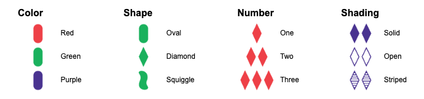

# Set
[Live Game Link](https://jsilvaroland.github.io/set/)

## Inspiration and Goals
Set is derived from the identically titled tabletop card game of pattern recognition. I aimed to create an accurate simulation of Set's game rules with modern design and responsive gameplay.

## Game Rules
The object of the game is to identify a Set of 3 cards from 12 placed face up on the field. Each card has four attributes, and each attribute has three possible variants as follows:

A Set consists of 3 cards in which each of the cards' attributes, looked at one-by-one, are either the same between each card OR different between each card. When the deck is empty and there are no remaining sets on the field, you win!

## Technologies
* JavaScript
* HTML5
    * Canvas
* CSS

## Technical Implementation
Code snippet for custom rounded rectangle function to come.
